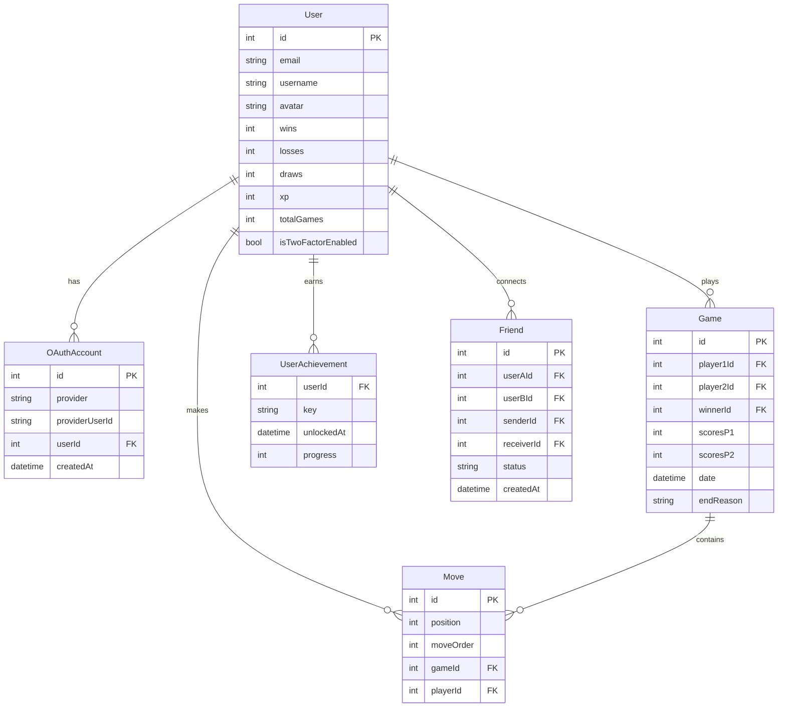

*This project has been created as part of the 42 curriculum by ameechan, nryser, nadahman, mbendidi and jdecarro.*

## Table of Contents

- [Description](#description)
- [Team Information](#team-information)
- [Project Management](#project-management)
- [Instructions](#instructions)
- [Features](#features)
- [Technical Stack](#technical-stack)
- [Database Schema](#database-schema)
- [Modules](#modules)
- [Individual Contributions](#individual-contributions)
- [Resources](#resources)

---

## Description

ft_transcendence is a full-stack web application built as the final project of the 42 Common Core curriculum.

It features real-time multiplayer Tic-Tac-Toe, user authentication with two-factor auth and OAuth, a friends and social system, live chat, match history, achievements, and multi-language support in English, French, and Spanish.

The stack runs entirely in Docker and is composed of a React frontend, a NestJS backend, and a PostgreSQL database behind an NGINX reverse proxy.

---

## Team Information

| Member | Title | Responsibilities |
| --- | --- | --- |
| ameechan | PO / Architect *(title TBD — pending team confirmation)* | All infrastructure: Docker, Docker Compose, Makefile, NGINX proxy config. Database seeding. Overall architecture design. |
| mbendidi | PM / Developer | Project management. Game logic, Tic-Tac-Toe engine, WebSocket gateway (game + chat), spectator mode, chat system. |
| nryser | Developer | All backend authentication: JWT, 2FA (TOTP), 42 OAuth. Friends system API. Swagger documentation. |
| nadahman | Developer | Achievement system, frontend–backend integration. *(specifics TBD — pending confirmation)* |
| jdecarro | Developer | Full frontend UI, component library (10+ reusable components), i18n (EN/FR/ES). |

---

## Project Management

- **Weekly meetings:** Held once a week on Discord. Meetings were used to review progress, unblock issues, and plan the week ahead. A written summary was posted in a dedicated channel after each meeting.

- **Decision making:** Most decisions were made as a team. Discord polls were regularly used to gather and collate opinions, keeping decisions transparent and democratic.

- **Communication:** The team Discord server was organised into dedicated text channels by domain (frontend, backend, database, infrastructure/Docker, meeting summaries, and more) to keep discussions relevant and easy to follow.

- **Task distribution:** Tasks were tracked on GitHub Issues and mapped to an Excalidraw Kanban board. Each week, tasks were distributed based on members' interest, their current area of work, and availability. When a team member was particularly swamped, another would step in to help.

---

## Instructions

### Prerequisites

- Docker
- Docker Compose

### Setup

**1. Clone the repository:**

```bash
git clone <repo-url>
```

Then navigate into the cloned directory.

**2. Set up your 42 OAuth credentials:**

```bash
cp oauth-credentials.conf.example oauth-credentials.conf
```

Open `oauth-credentials.conf` and fill in `FORTYTWO_CLIENT_ID` and `FORTYTWO_CLIENT_SECRET`.

To obtain these values, create an application at <https://profile.intra.42.fr/oauth/applications>.

**3. Run the setup wizard:**

```bash
make setup
```

Follow the prompts on screen.

- To test remote multiplayer on LAN: answer **yes** to the LAN setup prompt.
  Your LAN IP is detected and set automatically *(Linux only; auto-detection may not work on other systems)*.
- Otherwise skip. (`DOMAIN` defaults to `127.0.0.1`)

**4. Verify your IP:**

Open `.env.prod` and confirm `DOMAIN` matches your intended IP address before continuing.

### Run — Production

```bash
make prod
```

The application will be available at `https://<DOMAIN>`.

Accept the self-signed certificate warning in your browser.

### Run — Development

```bash
make up
```

Uses Vite HMR and HTTP only. Available at `http://localhost`.

### Useful Commands

| Command | Description |
| --- | --- |
| `make prod` | Build and start production stack |
| `make up` | Build and start dev stack |
| `make down` | Stop all containers |
| `make re` | Stop → rebuild → restart (dev) |
| `make reset` | Stop (remove volumes) → full rebuild → restart |
| `make logs` | Stream all container logs |
| `make logs-back` | Backend logs only |
| `make logs-front` | Frontend logs only |
| `make logs-proxy` | Proxy logs only |
| `make logs-db` | Database logs only |
| `make help` | Full colour-coded list of available targets |

---

## Features

| Feature | Description | Contributor(s) |
| --- | --- | --- |
| Tic-Tac-Toe multiplayer | Real-time game vs an opponent over WebSocket | mbendidi |
| Spectator mode | Watch live games in real-time | mbendidi |
| Live chat | Global real-time chat via WebSocket | mbendidi |
| JWT authentication | Secure login with HTTP-only cookie-based JWT | nryser |
| Two-Factor Authentication | TOTP-based 2FA via authenticator app (otplib) | nryser |
| 42 OAuth | Login via 42 Intra OAuth 2.0 | nryser |
| Friends system | Send, accept, and manage friend requests | nryser |
| Match history & stats | Per-user game statistics and full match history | nadahman + team *[TBD]* |
| Achievements | Unlockable milestones based on game and social activity | nadahman |
| Multi-language support | UI available in English, French, and Spanish | jdecarro |
| Design system | 10+ reusable UI components with consistent styling | jdecarro |
| Infrastructure tooling | Interactive `make setup` wizard, `make help` colour-coded command reference, dev/prod build targets | ameechan |

---

## Technical Stack

| Layer | Technology | Justification |
| --- | --- | --- |
| Frontend | React + Vite | Component model suits SPA architecture; Vite HMR speeds up development iteration |
| Routing | React Router | Standard SPA routing with `BrowserRouter` |
| Styling | Tailwind CSS | Utility-first CSS enforces visual consistency via design tokens |
| Backend | NestJS | Structured, opinionated framework with built-in dependency injection, guards, and decorators. This is suited for a multi-module API with auth, sockets, and REST. |
| Real-time | Socket.IO | Bidirectional WebSocket communication for game state and chat |
| Database | PostgreSQL | Robust relational database; strong Prisma support; well-suited to the relational data model |
| ORM | Prisma 7 | Type-safe ORM with schema-driven migrations; `@prisma/adapter-pg` for connection pooling |
| Proxy | NGINX | Single entry point; handles HTTP→HTTPS redirect and WebSocket upgrade |
| Containerisation | Docker + Docker Compose | Reproducible dev and prod environments; secrets-based config avoids `.env` exposure |

---

## Database Schema



---

## Modules

**Total: 17 points** across 13 modules.

### Major Modules (2 pts each)

| Module | Points | Contributor(s) |
| --- | --- | --- |
| Complete web-based game (Tic-Tac-Toe vs opponent) | 2 | mbendidi |
| Remote players (real-time multiplayer on separate machines) | 2 | mbendidi |
| User interaction (friends, social features) | 2 | mbendidi (chat/sockets), nryser (friends system) |
| Standard user management and authentication | 2 | nryser |

### Minor Modules (1 pt each)

| Module | Points | Contributor(s) |
| --- | --- | --- |
| Use a frontend framework (React + Vite) | 1 | jdecarro + team |
| Use a backend framework (NestJS) | 1 | nryser + team |
| Use an ORM for the database (Prisma 7) | 1 | ameechan + nryser |
| Remote authentication via OAuth 2.0 (42 OAuth) | 1 | nryser |
| Multiple language support (EN, FR, ES) | 1 | jdecarro |
| Custom design system (10+ reusable components) | 1 | jdecarro |
| Spectator mode | 1 | mbendidi |
| Two-Factor Authentication (TOTP via otplib) | 1 | nryser |
| Game statistics and match history | 1 | nadahman + team |

---

## Individual Contributions

| Member | Contributions | Challenges |
| --- | --- | --- |
| ameechan | Docker, Docker Compose, Makefile, NGINX proxy config, infrastructure setup, database seeding | *[TBD — pending team input]* |
| mbendidi | Game logic, Tic-Tac-Toe engine, WebSocket gateway (game + chat), spectator mode, chat system | *[TBD — pending team input]* |
| nryser | JWT authentication, 2FA (TOTP), 42 OAuth, friends system API, Swagger documentation | *[TBD — pending team input]* |
| nadahman | Achievement system, frontend–backend integration *(details TBD — pending confirmation)* | *[TBD — pending team input]* |
| jdecarro | Full frontend UI, component library (design system), i18n (EN/FR/ES) | *[TBD — pending team input]* |

---

## Resources

### Frontend

- React — <https://react.dev>
- Vite — <https://vite.dev>
- React Router — <https://reactrouter.com>
- Tailwind CSS — <https://tailwindcss.com/docs>

### Backend

- NestJS — <https://docs.nestjs.com>
- Socket.IO — <https://socket.io/docs/v4>
- otplib (2FA/TOTP) — <https://hectorm.github.io/otplib>

### Database and ORM

- PostgreSQL — <https://www.postgresql.org/docs>
- Prisma — <https://www.prisma.io/docs>

### Infrastructure

- Docker — <https://docs.docker.com>
- Docker Compose — <https://docs.docker.com/compose>
- NGINX — <https://nginx.org/en/docs>

### Auth

- 42 OAuth / Intra API — <https://api.intra.42.fr/apidoc>
- JWT (RFC 7519) — <https://datatracker.ietf.org/doc/html/rfc7519>

**Additional references:** *[TBD — pending team input]*

**AI usage:** *[TBD — pending team alignment]*

> WIP: AI was used for documentation maintenance, code review / logic checking, and brainstorming technical decisions.
