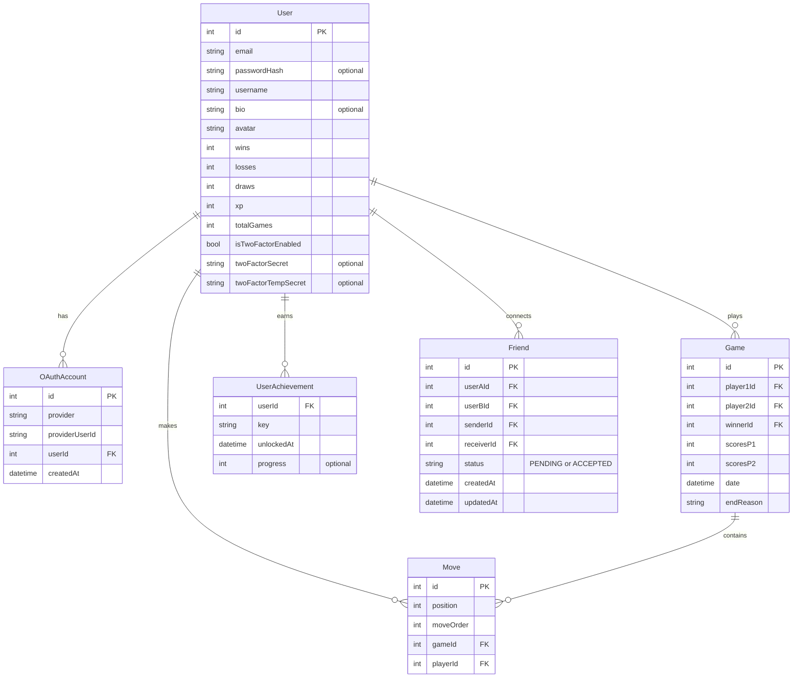

*This project has been created as part of the 42 curriculum by ameechan, nryser, nadahman, mbendidi and jdecarro.*

## Table of Contents

- [Description](#description)
- [Team Information](#team-information)
- [Project Management](#project-management)
- [Instructions](#instructions)
- [Features](#features)
- [Technical Stack](#technical-stack)
- [Database Schema](#database-schema)
- [Modules](#modules)
- [Individual Contributions](#individual-contributions)
- [Resources](#resources)

---

## Description

ft_transcendence is a full-stack web application built as the final project of the 42 Common Core curriculum.

It features real-time multiplayer Tic-Tac-Toe, user authentication with two-factor auth and OAuth, a friends and social system, live chat, match history, achievements, and multi-language support in English, French, and Spanish.

The stack runs entirely in Docker and is composed of a React frontend, a NestJS backend, and a PostgreSQL database behind an NGINX reverse proxy.

---

## Team Information

| Member | Title | Responsibilities |
| --- | --- | --- |
| mbendidi | PO / Developer | Project management. Game logic, Tic-Tac-Toe engine, WebSocket gateway (game + chat), spectator mode, chat system. |
| nadahman | PM / Developer | Achievement system, dynamic leaderboard with filters, match data recording and persistence, match history and XP progression, player profile access logic, auth persistence and profile synchronization, frontend–backend integration. |
| ameechan | Architect / Developer | All infrastructure: Docker, Docker Compose, Makefile, NGINX proxy config. Database seeding. Overall architecture design. |
| nryser | Developer | All backend authentication: JWT, 2FA (TOTP), 42 OAuth. Friends system API. Swagger documentation. |
| jdecarro | Developer | Full frontend UI, component library (10+ reusable components), i18n (EN/FR/ES). |

---

## Project Management

- **Weekly meetings:** Held once a week on Discord. Meetings were used to review progress, unblock issues, and plan the week ahead. A written summary was posted in a dedicated channel after each meeting.

- **Decision making:** Most decisions were made as a team. Discord polls were regularly used to gather and collate opinions, keeping decisions transparent and democratic.

- **Communication:** The team Discord server was organised into dedicated text channels by domain (frontend, backend, database, infrastructure/Docker, meeting summaries, and more) to keep discussions relevant and easy to follow.

- **Task distribution:** Tasks were tracked on GitHub Issues and mapped to an Excalidraw Kanban board. Each week, tasks were distributed based on members' interest, their current area of work, and availability. When a team member was particularly swamped, another would step in to help.

- **Sprints:** Development was organised in one-week sprints, occasionally extended to two weeks for larger features. Progress was reviewed and the next sprint planned at the weekly meeting.

---

## Instructions

### Prerequisites

If you wish to run this project with all its features on your own computer, you will need the following:

- Docker
- Docker Compose
- Make
- An app registered with the 42 API (Optional)

> **Note:** the project will still run without a registered 42 API app.
> However, you will not be able to login to the website via your 42 account.

> If you plan to use the OAuth login via the 42 API, you will need to register an app with them.
> You can refer to the official documentation for how to achieve this: https://api.intra.42.fr/apidoc

### Setup

**1. Clone the repository and navigate into the cloned directory:**

```bash
git clone <repo-url>
cd <cloned-directory-path>
```

**2. Set up your 42 OAuth credentials:**

*If you do not intend to use OAuth via the 42 API, skip to step 3.*

make a copy of `oauth-credentials.conf.example`

```bash
cp oauth-credentials.conf.example oauth-credentials.conf
```

> **Note:** it is absolutely **CRUCIAL** that the copy be named exactly `oauth-credentials.conf`
> to ensure these values remain git ignored.

**2.1 Open the copied file and replace variables:**

```text
FORTYTWO_CLIENT_ID=your_client_id_here 			<--- Replace this with UID
FORTYTWO_CLIENT_SECRET=your_client_secret_here	<--- Replace this with SECRET
```

*This is a one-time setup so your UID and SECRET persist between rebuilds and you don't need to add them each time
you destroy the stack and rebuild it.* `make setup` *automatically grabs the values stored in this file and copies them to the relevant secret files for you.*

> **Note:** `UID` and `SECRET` can be found by clicking on your created app here: <https://profile.intra.42.fr/oauth/applications>.

**3. Run the setup wizard:**

```bash
make setup
```

**3.1 Follow prompts on screen:**

```bash
Automatically setup DOMAIN? [Y/n]
```

- Accepting gives you the choice to setup local LAN for DEV and PROD.
- Refusing sets DOMAIN to `127.0.0.1` for DEV and PROD.

**3.2 Automatic DOMAIN setup (optional):**

```bash
# You should see these prompts if you accepted the automatic DOMAIN prompt
[DEV]   Set DOMAIN to local LAN? [Y/n]
[PROD]  Set DOMAIN to local LAN? [Y/n]

# Note that automatic IP detection is Linux only; This may not work on other systems
```

- To test remote multiplayer on LAN: answer **yes**. Your LAN IP is detected and set automatically. (Linux only)
- Otherwise, answer `no`. (`DOMAIN` defaults to `127.0.0.1`)

> **Note:** If you made a mistake, it is safe to run `make setup` again.

> **Note**: If you skipped the OAuth setup you will get a warning about OAuth related secrets. it is safe to ignore these.

**4. IMPORTANT - Update Secrets:**

`make setup` *is intended for a quick start if you just want to run the project quickly and see what it looks like.
This also means the default values for the secrets are hardcoded in the Makefile logic. Unnecessary to say that this is **NOT** good for a real production environment.*

So, please **make sure you change** the following secrets before running this in a live environment:

```text
- secrets/backend_pw.txt
- secrets/postgres_root_pw.txt
- secrets/jwt_secret.txt
```

---

### Run — Production

```bash
make prod
```

The application will be available at `https://<DOMAIN>:8443`.
Or by HTTP redirect via `http://<DOMAIN>:8080`.

Accept the self-signed certificate warning in your browser.

### Run — Development

```bash
make up
```

Uses Vite HMR and HTTP only. Available at `http://localhost:1024`.

### Useful Commands

| Command | Description | Stack |
| --- | --- | --- |
| `make help` | Full colour-coded list of available targets | |
| `make prod` | Build and start production stack | PROD |
| `make up` | Build and start dev stack | DEV |
| `make ps` | Display all running containers | PROD & DEV |
| `make down-all` | Stop all containers from both stacks. Safe to use with one stack running | PROD & DEV |
| `make reset` | Stop → remove volumes → full rebuild → restart | DEV |
| `make clean` | Remove dangling images, stopped containers, unused networks + build cache | PROD & DEV |
| `make nuke` | Full wipe → stops stack → removes volumes + images → deletes .env + secrets | PROD & DEV |
| `make logs` | Stream all DEV container logs | DEV |
| `make p-logs` | Stream all PROD container logs | PROD |
| `make logs-help` | Show all available log commands | |
| `make swagger` | Print URL to access Swagger Documentation | |
| `make prisma` | Start Prisma Studio (Stack MUST be running) | DEV |

---

## Features

| Feature | Description | Contributor(s) |
| --- | --- | --- |
| Tic-Tac-Toe multiplayer | Real-time game vs an opponent over WebSocket | mbendidi |
| Spectator mode | Watch live games in real-time | mbendidi |
| Live chat | Global real-time chat via WebSocket | mbendidi |
| JWT authentication | Secure login with HTTP-only cookie-based JWT | nryser |
| Two-Factor Authentication | TOTP-based 2FA via authenticator app (otplib) | nryser |
| 42 OAuth | Login via 42 Intra OAuth 2.0 | nryser |
| Friends system | Send, accept, and manage friend requests | nryser |
| Match history & stats | Per-user game statistics, XP progression, and full match history | nadahman |
| Achievements | Unlockable milestones based on game and social activity | nadahman |
| Dynamic leaderboard | Filterable rankings with player stats | nadahman |
| Player profiles | Per-user profile pages with stats and match history | nadahman |
| Auth persistence & profile sync | Session continuity and profile synchronization across logins | nadahman |
| Multi-language support | UI available in English, French, and Spanish | jdecarro |
| Design system | 10+ reusable UI components with consistent styling | jdecarro |
| Infrastructure tooling | Interactive `make setup` wizard, `make help` colour-coded command reference, dev/prod build targets | ameechan |

---

## Technical Stack

### Core Technologies

| Layer | Technology | Why we chose it |
| --- | --- | --- |
| Frontend | React + Vite | React's component model fits the SPA architecture and directly supports the reusable components module. TypeScript across front and backend keeps the codebase consistent and adds type safety — helpful when learning. Vite integrates naturally with React and its HMR speeds up dev iteration. |
| Backend | NestJS | Its rigid, opinionated structure enforces consistent patterns across the team — important when everyone is learning and reading each other's code. Built-in dependency injection, guards, and decorators suit a multi-module API handling auth, sockets, and REST. |
| Database | PostgreSQL | Robust relational database well-suited to the data model (Users, Games, Moves, Friends, Achievements). Strong Prisma integration and solid NestJS ecosystem support made it a practical choice. |
| ORM | Prisma 7 | Type-safe ORM that pairs naturally with PostgreSQL. Schema-driven approach keeps the data model explicit and `@prisma/adapter-pg` adds connection pooling. |
| Proxy | NGINX | Familiar from prior 42 projects (webserv, inception). Acts as the single entry point: handles HTTP→HTTPS redirect, WebSocket upgrade, and proxies traffic to frontend and backend. |
| Containerisation | Docker + Docker Compose | Familiar from inception. Reproducible dev and prod environments; secrets-based config keeps sensitive values out of committed files. Multi-stage Dockerfiles keep production images lean. |

### Additional Technologies

| Layer | Technology | Why we chose it |
| --- | --- | --- |
| Routing | React Router | Standard SPA routing for React; `BrowserRouter` provides client-side navigation with minimal setup. |
| Styling | Tailwind CSS | Required by the subject. Utility-first approach speeds up styling and enforces visual consistency through design tokens. |
| Real-time | Socket.IO | Bidirectional WebSocket library with built-in room management — well-suited for real-time game state sync and live chat. |

---

## Database Schema



---

## Modules

**Total: 17 points** across 13 modules.

### Major Modules (2 pts each)

| Module | Points | Contributor(s) |
| --- | --- | --- |
| Complete web-based game (Tic-Tac-Toe vs opponent) | 2 | mbendidi |
| Remote players (real-time multiplayer on separate machines) | 2 | mbendidi |
| User interaction (friends, social features) | 2 | mbendidi (chat/sockets), nryser (friends system) |
| Standard user management and authentication | 2 | nryser |

### Minor Modules (1 pt each)

| Module | Points | Contributor(s) |
| --- | --- | --- |
| Use a frontend framework (React + Vite) | 1 | jdecarro |
| Use a backend framework (NestJS) | 1 | nryser |
| Use an ORM for the database (Prisma 7) | 1 | nryser + ameechan |
| Remote authentication via OAuth 2.0 (42 OAuth) | 1 | nryser + ameechan |
| Multiple language support (EN, FR, ES) | 1 | jdecarro |
| Custom design system (10+ reusable components) | 1 | jdecarro |
| Spectator mode | 1 | mbendidi |
| Two-Factor Authentication (TOTP via otplib) | 1 | nryser + ameechan |
| Game statistics and match history | 1 | nadahman |

---

## Individual Contributions

| Member | Contributions |
| --- | --- |
| ameechan | - Docker, Docker Compose, Makefile<br>- NGINX proxy config<br>- Infrastructure setup<br>- Database seeding |
| mbendidi | - Game logic, Tic-Tac-Toe engine<br>- WebSocket gateway (game + chat)<br>- Spectator mode<br>- Chat system |
| nryser | - JWT auth architecture (HttpOnly cookies, global guard, DTO validation, protected/public route logic)<br>- 2FA (TOTP): QR onboarding, partial auth flow with `2fa_pending` cookie, rate limiting<br>- 42 OAuth: account linking, username normalization and collision handling<br>- Friends system API (send, accept, decline, remove, list)<br>- Realtime presence and websocket authentication<br>- Profile and settings backend (avatar upload, public/private profile separation)<br>- Swagger/OpenAPI documentation |
| nadahman | - Achievement system<br>- Dynamic leaderboard with filters<br>- Match data recording, persistence, history and XP progression<br>- Player profile access logic<br>- Auth persistence and profile synchronization<br>- Frontend–backend integration<br>- Some translations, early login/register frontend work |
| jdecarro | - Full frontend UI (pages, layout)<br>- Component library (design system)<br>- i18n (EN/FR/ES, config and translations)<br>- Active game state management and real-time sync (Zustand + global socket)<br>- Active game presence system (emits in game service + presence service) |

### Challenges

#### Learning TypeScript

None of us had meaningful TypeScript experience coming into the project. We learned at our own pace, relying on pair programming sessions on Discord with screen sharing and/or leaning on each other for support and understanding.

While this slowed us down at first, it paid off in the long term. Proper typing allowed for catching errors at compile time rather than runtime, making it easier to keep on top of the codebase as it grew.

#### Keeping Focus When Everything Blurs Together

With so many tasks running in parallel and the open-ended nature of the modules, it was easy to lose sight of what actually needed to be done versus what was us going too far down the rabbit hole.

We used Excalidraw as a shared Kanban board to track modules and features visually, which not only helped everyone stay focused but also allowed us to draw the line on when we were heading too far outside the scope of the selected modules.

#### Building a Workflow That Works for Everyone

We settled on a set of conventions early, a GitHub Issue for every change before writing a single line of code, a strict commit message format (`type(scope): short message`), and PRs written to a shared standard.

It was a lot to take on at first, but across different schedules and availability it kept us aligned without needing to always be online at the same time.

#### Balancing Life and Code

Everyone on the team has their own commitments outside the project, be it family, work, or other responsibilities. Juggling all these obligations while maintaining the ability to contribute substantially to the project was a challenge in itself.

We tried not to let that create guilt or friction and had a dedicated 'absence' channel in Discord to handle this matter. Each member was responsible for giving sufficient warning about any absence and to do their best to compensate for it when possible, whether by working twice as hard before leave or asking for help from a teammate.

Furthermore, our weekly Monday meeting helped stay in sync and plan for any prolonged absences.

#### The Language Barrier

Mixed comfort levels across English and French added friction that a single-language team doesn't face.

French was the natural choice for meetings as everyone could express themselves more freely than if the meetings had been conducted in English.

English was the obvious choice for code communication as it is the industry standard, and posed the added benefit of being written, thus making translation tools a practical aid for those who needed it.

This kept discussions fluid and the repository consistent without forcing anyone into a language they weren't comfortable speaking. When needed, teammates would step in to bridge gaps mid-meeting, keeping the conversation moving without derailing into full translations.

#### Keeping the Frontend Clean and Scalable

As the project grew, the frontend became harder to maintain. Components that were written early on didn't hold up as the design evolved.

We gradually replaced one-off components with reusable ones, improving consistency in layout and readability. It never felt fully finished, but each pass left things cleaner than before.

#### Collaborating Remotely as Strangers

We didn't know each other before the project and intended from early on to work mostly remotely due to multiple team members living a considerable distance away from the school. Naturally, this was a source of potential concern to begin with.

However, a handful of early in-person meetings at school helped put faces to the usernames and create the team cohesion required for remote work.

From there, we built a culture around openness and honesty. If something wasn't working, we said so and discussed accordingly. The weekly Monday meetings often ran 3 to 4 hours and were rescheduled if someone couldn't make it.

This ensured all bases were covered and each member had time to share any updates, questions and concerns they had.

#### Designing a Unified Auth Architecture

The authentication system had to work consistently across REST endpoints, WebSocket connections, 42 OAuth, and TOTP-based 2FA. Each layer added new constraints. Cookies behaved differently over WebSockets, OAuth required a partial authentication state before a full session could be issued, and 2FA needed its own intermediate step without prematurely granting access.

We solved this by centralising everything behind a single global JWT guard and modelling partial authentication explicitly using a temporary cookie before full session validation. It required more upfront design than wiring things up case by case, but it kept the logic predictable and consistent across the entire backend.

#### Realtime Synchronisation Across Clients

Keeping multiple clients in sync in real time turned out to be harder than expected. A user could be connected from several tabs at once, disconnect mid-session, or change state in ways that needed to propagate immediately to others. Friend status, online presence, and active game state all needed to stay consistent without polling.

We addressed this by building a centralised socket-based presence system and routing all realtime state through it. Having one consistent model for who was online and what they were doing made edge cases easier to reason about and kept the frontend reliably in sync.

---

## Resources

### Frontend

- React — <https://react.dev>
- Vite — <https://vite.dev>
- React Router — <https://reactrouter.com>
- Tailwind CSS — <https://tailwindcss.com/docs>

### Backend

- NestJS — <https://docs.nestjs.com>
- Socket.IO — <https://socket.io/docs/v4>
- otplib (2FA/TOTP) — <https://hectorm.github.io/otplib>

### Database and ORM

- PostgreSQL — <https://www.postgresql.org/docs>
- Prisma — <https://www.prisma.io/docs>

### Infrastructure

- Docker — <https://docs.docker.com>
- Docker Compose — <https://docs.docker.com/compose>
- NGINX — <https://nginx.org/en/docs>

### Auth

- 42 OAuth / Intra API — <https://api.intra.42.fr/apidoc>
- JWT (RFC 7519) — <https://datatracker.ietf.org/doc/html/rfc7519>

### Additional References

- Apprendre React by Grafikart.fr — <https://www.youtube.com/playlist?list=PLjwdMgw5TTLUEOKPg5Z5TgwAOeWkjGL69>
- Zustand (state management) — <https://zustand.docs.pmnd.rs>

### AI Usage

AI (Claude) was used across the following areas:

- **Documentation:** Maintaining docs and keeping the README up to date.
- **Code review:** Checking logic and acting as a second pair of eyes to catch oversights.
- **Technical guidance:** Brainstorming and advising on technical decisions.
- **Pull requests:** Support for reviewing and writing PRs clearly and understandably.
- **Task breakdown:** Breaking large tasks into smaller, easier-to-follow steps.
- **Concept explanation:** Breaking down hard-to-grasp concepts into clearer, more approachable explanations.
